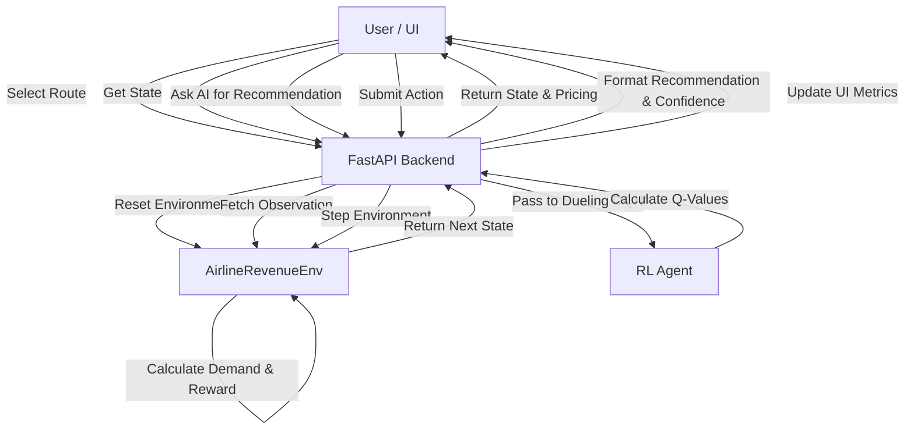

# RL-Integrated Multi-Class Airline Dynamic Pricing

Welcome to the **Airline Dynamic Pricing** simulation, a high-performance reinforcement learning project built with Python and FastAPI. This project simulates a competitive airline market where an autonomous agent dictates pricing for multiple seat classes (Economy and Business) to maximize revenue across various routes. 

Our application architecture relies on advanced Deep Q-Networks (DQN) synchronized to a customized Gymnasium simulation environment and visualized seamlessly via a premium, aerospace-themed dashboard.

## 💻 Technology Stack

* **Backend Framework:** FastAPI (Async Python)
* **Reinforcement Learning:** PyTorch (Dueling DQN)
* **Environment Simulation:** Gymnasium (OpenAI Gym successor)
* **Mathematical Operations:** NumPy
* **Frontend:** Vanilla HTML/JS, advanced CSS with CSS Grid & Glassmorphism
* **Containerization:** Docker & Docker Compose
* **Dependency Management:** UV (Fast Python package installer)

## 🚀 Advanced Codebase Architecture

This project strictly utilizes a **Modular Design** to cleanly separate the mathematical algorithms from the web interfaces and infrastructure logic. The codebase is broken down into specific domains:

### 1. The Autonomous Brain (Reinforcement Learning)
The agent operates via a **Dueling DQN** utilizing **Soft Updates** and **N-Step Returns**.
* By factoring estimates into `Value` (how good the current state is) and `Advantage` (how good a specific action is compared to others), the Dueling architecture converges faster in environments with highly correlated action outcomes.
* We leverage static, pre-allocated **NumPy Replay Buffers** to eliminate memory fragmentation during the sampling loops, vastly speeding up throughput.

### 2. The Simulation Environment
Built on top of `gymnasium`, the `AirlineRevenueEnv` simulates dynamic aspects of the real world:
* Tracks 90 days prior to flight departure.
* Dynamically calibrates competitor strategy from generated or historical route statistics.
* Handles unpredictable disruptions (weather, strikes, competitive surges).
* Encapsulates state observation into vectorized spaces for lightning-fast training throughput.

### 3. The Analytics Dashboard
Built in **FastAPI** to eliminate synchronous polling bottlenecks present in traditional Flask setups. The frontend uses highly optimized HTML/JS, layered with complex CSS glassmorphism, glowing neons, and futuristic aerospace fonts (Space Grotesk & Inter) for a dazzling user experience.

---

## 📂 Modular Folder Structure

The project directory is explicitly separated into domain-specific modules for clean scaling:

```yaml
Dynamic_Pricing/
│
├── agents/                 # 🧠 Neural Net Intelligence
│   ├── model.py            # Dueling DQN architecture, PyTorch NN definitions
│   └── buffer.py           # Pre-allocated NumPy static Replay Buffer
│
├── baselines/              # 📊 Comparative Strategies
│   └── traditional_pricing.py # Rule-based and random algorithmic benchmarks
│
├── config/                 # ⚙️ Centralized Settings
│   └── config.py           # RL Hyperparameters, server configurations
│
├── data/                   # 💾 Raw & Calibrated Data
│   ├── flight_data.csv     # Historical route info (or sample_data.csv)
│   └── route_stats.pkl     # Calibrated statistics environment seed
│
├── environment/            # 🌍 World Simulation
│   └── airline_env.py      # Gymnasium multi-class pricing simulation
│
├── models/                 # 💾 Saved Brains
│   └── trained_models/     # Best/final serialized .pth PyTorch checkpoints
│
├── static/                 # 🎨 UI/UX Assets 
│   ├── css/                # Glassmorphic, aerospace HUD dark themes
│   ├── js/                 # Async dashboard handlers and Chart.js integrations
│   └── images/             # Vector icons and graphics
│
├── templates/              # 🖥️ Web Pages
│   ├── index.html          # Dashboard Jinja2 simulation template
│   └── landing.html        # Futuristic entry portal
│
├── training/               # 🚂 Training Pipeline
│   └── train.py            # Curriculum learning runner logic
│
├── utils/                  # 🛠️ Helper Functions
│   └── data_loader.py      # Pandas DataFrame parsers
│
└── [Root Level Executables]
    ├── app.py              # Main FastAPI / Uvicorn Server
    ├── analyze_data.py     # Calibration execution script
    ├── run.sh              # Unix terminal orchestration
    ├── Dockerfile          # Container specification
    ├── docker-compose.yml  # Container composition network
    └── requirements.txt    # UV-optimized PIP dependencies
```

---

## 🛠️ Setup and Installation

### Recommended Setup (Automated via Unix)
We recommend utilizing `uv` for blistering-fast dependency management through our integrated startup script:

1. **Initialize & Sync Dependencies**:
   ```bash
   ./run.sh
   ```
   *This automatically sets up `uv`, creates a virtual environment, syncs the `requirements.txt`, and calibrates the `data/` folder.*

2. **Launch via FastAPI App locally**:
   ```bash
   python app.py
   ```
   Open `http://127.0.0.1:8080` in your browser.

### Docker Initialization
You can run the application synchronously in an isolated container utilizing the updated `uvicorn` entrypoints:

```bash
# Build the container locally
docker compose up --build

# Or detach the process in the background
docker compose up --build -d
```

---

## 🔄 System Flow

Below is the high-level flow demonstrating how the user, backend, and RL agent interact during a session.



## 📡 API Endpoints Reference

The FastAPI server exposes several JSON endpoints designed for high-frequency async polling from the UI without locking up the RL agent inference models:

### Environment & State
- **`GET /api/state`**: Returns the current observation metrics for both Economy and Business classes, including pricing, load factors, days to departure, and total revenue.
- **`GET /api/routes`**: Returns a list of all 30 calibrated flight routes and the currently active route.
- **`POST /api/change_route`**: Accepts a `route` string to switch the active simulation environment.
- **`POST /api/reset`**: Resets the current environment simulation back to Day 90.

### Actions & Simulation
- **`POST /api/action`**: Accepts an integer `action` (0-8) to step the environment forward one day. Returns the revenue generated, bookings made, and the RL reward.
- **`POST /api/disruption`**: Accepts a disruption `type` (`weather`, `pilot_strike`, `competitor_cancel`, or `none`) to manually trigger environmental events that aggressively sway demand probabilities.

### Artificial Intelligence
- **`GET /api/ai_recommendation`**: Performs a swift PyTorch Q-value spread operation on the current state. Returns the agent's recommended action, a sorted list of alternative actions (Softmax probabilities), an underlying confidence score, and a text-based logical reasoning string explaining *why* it chose that action.
- **`POST /api/run_comparison`**: Executes headless synchronous simulations matching the RL agent against Rule-Based and Random strategies, simulating through `N` episodes simultaneously to benchmark performance.
- **`GET /api/agent_info`**: Returns metadata about the currently loaded PyTorch `.pth` model, including the device mode (`MPS`, `CUDA`, `CPU`), exploration rate, and training metrics.

## 🏃 Training the Agent

If you wish to augment the RL agent from scratch and retrain the Neural Networks:

```bash
source .venv/bin/activate
python training/train.py
```
*Note: Depending on your hardware accelerator (`MPS`, `CUDA`, or `CPU`), the 6000 episodes may take between 10 to 30 minutes.*
